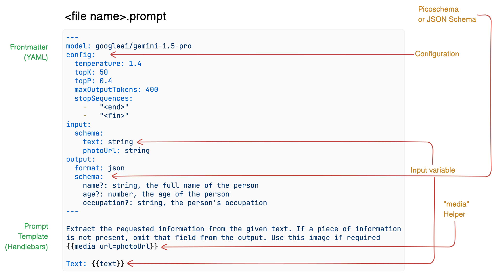

# The `.prompt` file

Dotprompt files bearing the `.dotprompt` extension contain configuration in the
form of YAML front matter delineated by `---` sequences followed by
variable-interpolated UTF-8 encoded text templates, which can optionally use
[Handlebars](https://handlebarsjs.com) for templating.



## Examples

=== "Example 1"

    Here's an example of a `.prompt` file that extracts structured data from
    provided text:

    ```handlebars
    ---
    model: googleai/gemini-1.5-pro
    input:
      schema:
        text: string
    output:
      format: json
      schema:
        name?: string, the full name of the person
        age?: number, the age of the person
        occupation?: string, the person's occupation
    ---

    Extract the requested information from the given text. If a piece of information
    is not present, omit that field from the output.

    Text: {{text}}
    ```

    The portion in the triple-dashes is YAML front matter. The rest of the file is
    the prompt, which can optionally use Handlebars templates.

    This Dotprompt file:

    1. Specifies the use of the `googleai/gemini-1.5-pro` model.
    2. Defines an input schema expecting a `text` string.
    3. Specifies that the output should be in JSON format.
    4. Provides a schema for the expected output, including fields for name, age,
      and occupation.
    5. Uses Handlebars syntax (`{{text}}`) to insert the input text into the prompt.

    When executed, this prompt would take a text input, analyze it using the
    specified AI model, and return a structured JSON object with the extracted
    information.

=== "Example 2"

    Here is another example `.prompt` file:

    ```handlebars
    ---
    model: googleai/gemini-1.5-flash
    config:
      temperature: 0.9
    input:
      schema:
        location: string
        style?: string
        name?: string
      default:
        location: a restaurant
    ---

    You are the world's most welcoming AI assistant and are currently working at {{location}}.

    Greet a guest{{#if name}} named {{name}}{{/if}}{{#if style}} in the style of {{style}}{{/if}}.
    ```

    This Dotprompt file:

    1. Specifies the use of the `googleai/gemini-1.5-flash` model.
    2. Defines a config block with a `temperature` of 0.9.
    3. Specifies an input schema with a `location` string and optional `style` and
      `name` strings.
    4. Provides a default value for the `location` field.
    5. Uses Handlebars syntax (`{{location}}`) to insert the value of the `location`
      field into the prompt.

## Model configuration

In the front matter block of your prompt files, you can optionally specify model
configuration values for your prompt.

```handlebars
---
model: googleai/gemini-1.5-flash
config:
  temperature: 1.4
  topK: 50
  topP: 0.4
  maxOutputTokens: 400
  stopSequences:
    -   "<end>"
    -   "<fin>"
---
```

## Input and Output Schemas

You can specify input and output schemas for your prompt by defining them in the
front matter section:

```handlebars
---
model: googleai/gemini-1.5-flash
input:
  schema:
    theme?: string
  default:
    theme: "pirate"
output:
  schema:
    dishname: string
    description: string
    calories: integer
    allergens(array): string
---
Invent a menu item for a {{theme}} themed restaurant.
```

You have several options for defining schemas in a `.prompt`
file:
- Dotprompt's own schema definition format, Picoschema
- standard JSON schema
- references to schemas defined in your application code

### Picoschema

The schemas in the example above are defined in a format called Picoschema.
Picoschema is a compact, YAML-optimized schema definition format that makes it
easy to define the most important attributes of a schema for LLM usage. Here's a
longer example of a schema, which specifies the information an app might store
about an article:

```yaml
schema:
  title: string                                           # string, number, and boolean types are defined like this
  subtitle?: string                                       # optional fields are marked with a `?`
  draft?: boolean, true when in draft state
  status?(enum, approval status): [PENDING, APPROVED]
  date: string, the date of publication e.g. '2024-04-09' # descriptions follow a comma
  tags(array, relevant tags for article): string          # arrays are denoted via parentheses
  authors(array):
    name: string
    email?: string
  metadata?(object):                                      # objects are also denoted via parentheses
    updatedAt?: string, ISO timestamp of last update
    approvedBy?: integer, id of approver
  extra?: any, arbitrary extra data
  (*): string, wildcard field
```

The YAML schema is equivalent to the code in several languages, viz. TypeScript,
Go, and Python:

=== "TypeScript"

    ```typescript
    interface Article {
      title: string;
      subtitle?: string | null;
      /** true when in draft state */
      draft?: boolean | null;
      /** approval status */
      status?: 'PENDING' | 'APPROVED' | null;
      /** the date of publication e.g. '2024-04-09' */
      date: string;
      /** relevant tags for article */
      tags: string[];
      authors: {
        name: string;
        email?: string | null;
      }[];
      metadata?: {
        /** ISO timestamp of last update */
        updatedAt?: string | null;
        /** id of approver */
        approvedBy?: number | null;
      } | null;
      /** arbitrary extra data */
      extra?: any;
      /** wildcard field */

    }
    ```

=== "Go"

    ```go
    // Article represents an article with its metadata
    type Article struct {
        Title    string   `json:"title"`
        Subtitle *string  `json:"subtitle,omitempty"`
        Draft    *bool    `json:"draft,omitempty"`     // true when in draft state
        Status   *string  `json:"status,omitempty"`    // approval status: PENDING or APPROVED
        Date     string   `json:"date"`                // the date of publication e.g. '2024-04-09'
        Tags     []string `json:"tags"`                // relevant tags for article
        Authors  []Author `json:"authors"`
        Metadata *struct {
            UpdatedAt  *string `json:"updatedAt,omitempty"`  // ISO timestamp of last update
            ApprovedBy *int    `json:"approvedBy,omitempty"` // id of approver
        } `json:"metadata,omitempty"`
        Extra       any          `json:"extra,omitempty"`    // arbitrary extra data
        ExtraFields map[string]string    `json:"-"`                  // wildcard fields
    }

    type Author struct {
        Name  string  `json:"name"`
        Email *string `json:"email,omitempty"`
    }

    // ValidStatus returns whether the status is valid
    func ValidStatus(s string) bool {
        return s == "PENDING" || s == "APPROVED"
    }
    ```

=== "Python (Pydantic)"

    ```python
    from typing import Any
    from enum import Enum
    from pydantic import BaseModel, Field

    class Status(str, Enum):
        PENDING = "PENDING"
        APPROVED = "APPROVED"

    class Author(BaseModel):
        name: str
        email: str | None = None

    class Metadata(BaseModel):
        updated_at: str | None = Field(None, description="ISO timestamp of last update")
        approved_by: int | None = Field(None, description="id of approver")

    class Article(BaseModel):
        title: str
        subtitle: str | None = None
        draft: bool | None = Field(None, description="true when in draft state")
        status: Status | None = Field(None, description="approval status")
        date: str = Field(..., description="the date of publication e.g. '2024-04-09'")
        tags: list[str] = Field(..., description="relevant tags for article")
        authors: list[Author]
        metadata: Metadata | None = None
        extra: Any | None = Field(None, description="arbitrary extra data")
        extra_fields: dict[str, str] = Field(default_factory=dict, description="wildcard fields")

        class Config:
            extra = "allow"  # Allows additional fields to be stored in extra_fields
    ```

Picoschema supports scalar types `string`, `integer`, `number`, `boolean`, and
`any`.  Objects, arrays, and enums are denoted by a parenthetical after the
field name.

Objects defined by Picoschema have all properties required unless denoted
optional by `?`, and do not allow additional properties. When a property is
marked as optional, it is also made nullable to provide more leniency for LLMs
to return null instead of omitting a field.

In an object definition, the special key (`*`) can be used to declare a
"wildcard" field definition. This will match any additional properties not
supplied by an explicit key.

### JSON Schema

Picoschema does not support many of the capabilities of full JSON schema.
If you require more robust schemas, you may supply a JSON Schema instead:

```yaml
output:
  schema:
    type: object
    properties:
      field1:
        type: number
        minimum: 20
```

### Code-defined schemas

In additional to defining schemas in the `.prompt` file, you can reference a
schema in code. You can read more about how [Firebase Genkit handles
it](https://firebase.google.com/docs/genkit/dotprompt#zod_schemas_defined_in_code).

Dotprompt allows you to refer to a registered code-defined schema by name. For
example, when you define a schema using
[Genkit](https://firebase.google.com/docs/genkit) and [Zod](https://zod.dev/) as
follows:


```TypeScript
import { z } from 'genkit';

const MenuItemSchema = ai.defineSchema(
  'MenuItemSchema',
  z.object({
    dishname: z.string(),
    description: z.string(),
    calories: z.coerce.number(),
    allergens: z.array(z.string()),
  })
);
```

You may refer to it in the `.dotprompt` file as follows:

```handlebars
---
model: googleai/gemini-1.5-flash-latest
output:
  schema: MenuItemSchema
---
```

The Dotprompt library will automatically resolve the name to the underlying
registered Zod schema.

## Helpers

Dotprompt provides several helpers to help you enhance your `.dotprompt`
templates.

### Multi-message prompts and the `role` helper

By default, Dotprompt constructs a single message with a "user" role. However,
some prompts are best expressed as a combination of multiple messages, such as a
system prompt.

The `{{role}}` helper provides a simple way to construct multi-message prompts:

```handlebars
---
model: vertexai/gemini-1.5-flash
input:
  schema:
    userQuestion: string
---
{{role "system"}}
You are a helpful AI assistant that really loves to talk about food. Try to work
food items into all of your conversations.
{{role "user"}}
{{userQuestion}}
```

### Multi-modal prompts and the `media` helper

For models that support multi-modal input, such as images alongside text, you
can use the `{{media}}` helper:

```handlebars
---
model: vertexai/gemini-1.5-flash
input:
  schema:
    photoUrl: string
---
Describe this image in a detailed paragraph:
{{media url=photoUrl}}
```

The URL can be `https:` or base64-encoded [`data:`
URIs](https://en.wikipedia.org/wiki/Data_URI_scheme) for "inline" image usage.

### Defining custom helpers

You can define custom helpers to process and manage data inside of a prompt.
Helpers are registered globally using `defineHelper`:

=== "TypeScript"

    ```TypeScript
    ai.defineHelper('shout', (text: string) => text.toUpperCase());
    ```

=== "Go"

    ```go
    // TODO
    ```

=== "Python"

    ```python
    # TODO
    ```

Once the helper has been defined you can use it in any prompt:

```handlebars
---
model: googleai/gemini-1.5-flash
input:
  schema:
    name: string
---

HELLO, {{shout name}}!!!
```

## Partials

Partials are reusable templates that can be included inside any prompt. Partials
can be especially helpful for related prompts that share common behavior.

### Defining partials as files

When loading a prompt directory, any file prefixed with an underscore (`_`) is
considered a partial. So a file `_personality.prompt` might contain:

=== "_personality.prompt"

    ```
    You should speak like a {{#if style}}{{style}}{{else}}helpful assistant.{{/else}}.
    ```

This can then be included in other prompts:

```handlebars
---
model: googleai/gemini-1.5-flash
input:
  schema:
    name: string
    style?: string
---
{{ role "system" }}
{{>personality style=style}}

{{ role "user" }}
Give the user a friendly greeting.

User's Name: {{name}}
```

Partials are inserted using the `{{>NAME_OF_PARTIAL args...}}` syntax. If no
arguments are provided to the partial, it executes with the same context as the
parent prompt.

Partials accept both named arguments as above or a single positional argument
representing the context. This can be helpful for tasks such as rendering
members of a list.

=== "_destination.prompt"

    ```
    - {{name}} ({{country}})
    ```

=== "chooseDestination.prompt"

    ```handlebars
    ---
    model: googleai/gemini-1.5-flash-latest
    input:
      schema:
        destinations(array):
          name: string
          country: string
    ---
    Help the user decide between these vacation destinations:

    {{#each destinations}}
    {{>destination this}}
    {{/each}}
    ```

### Defining partials in code

You can also define partials in code using `definePartial` as follows:

```TypeScript
ai.definePartial(
  'personality',
  'Talk like a {{#if style}}{{style}}{{else}}helpful assistant{{/if}}.'
);
```

Code-defined partials are available in all prompts.

## Prompt variants

Because prompt files are just text, you should commit them to your version
control system, allowing you to compare changes over time easily. Often, tweaked
versions of prompts can only be fully tested in a production environment
side-by-side with existing versions. Dotprompt supports this through its
variants feature.

To create a variant, create a `[name].[variant].prompt` file. For instance, if
you were using Gemini 1.5 Flash in your prompt but wanted to see if Gemini 1.5
Pro would perform better, you might create two files:

- `my_prompt.prompt`: the "baseline" prompt
- `my_prompt.gemini15pro.prompt`: a variant named `gemini15pro`

To use a prompt variant, specify the variant option when loading:

=== "TypeScript"

    ```typescript
    const myPrompt = ai.prompt('my_prompt', { variant: 'gemini15pro' });
    ```

=== "Go"

    ```go
    // TODO
    ```

=== "Python"

    ```python
    # TODO
    ```

The name of the variant is included in the metadata of generation traces, so you
can compare and contrast actual performance between variants in the Genkit trace
inspector.
